# Autonomous BDR — App Flow Document

**Version**: 1.0
**Date**: 2026-03-28
**Status**: Reference for Phase 1 Implementation

---

## 1. Overview

The Autonomous BDR app orchestrates a complete outbound sales cycle through six core user flows. All flows are designed for L2 autonomy (first touch approval) as the Phase 1 default, with branching paths for different autonomy levels.

### Major User Flows
1. **Onboarding Flow** — Sign up → Configure voice → Setup campaigns
2. **Campaign Creation Flow** — Create campaign → Define targets → Upload accounts → Research → Ready
3. **Email Approval Flow** — Review first touches → Approve or edit → Auto-schedule follow-ups
4. **Reply Handling Flow** — Monitor inbox → Classify replies → User decision or auto-action
5. **Meeting Booking Flow** — Positive reply → Calendar proposal → Prospect accepts/declines
6. **Dashboard Flow** — Overview of campaigns, reply queue, reasoning, and settings

---

## 2. Core User Flows

### A. Onboarding Flow

**Duration**: ~10 minutes | **Autonomy**: Setup phase (no autonomy yet)

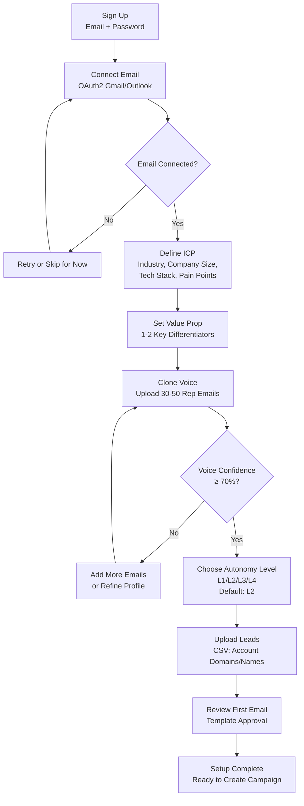

**Steps**:
1. User signs up with email and password
2. Connect inbox via OAuth2 (Gmail or Outlook for reply monitoring)
3. Define ICP: industry, company size range, revenue signals, tech stack
4. Set value prop: 2–3 key differentiators for personalization
5. Clone voice: upload 30–50 sent emails from rep (system extracts tone, templates, sign-off)
6. **Decision**: If confidence < 70%, request additional emails (system will retry analysis)
7. Choose autonomy level (L1 = human approves all, L2 = auto follow-ups, default L2)
8. Upload leads: CSV with account domains and/or company names
9. Review template: system shows first email template for user approval
10. Onboarding complete: proceed to campaign creation

---

### B. Campaign Creation Flow

**Duration**: ~5 minutes | **Autonomy**: User defines scope

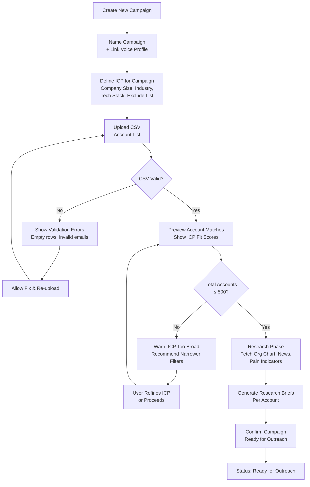

**Steps**:
1. User clicks "Create New Campaign"
2. Name campaign and select or create voice profile
3. Define campaign-specific ICP (may differ from global)
4. Upload CSV: account domains, company names, optional buyer email
5. **Validation**: Check for empty rows, invalid emails; show errors if found
6. **Decision**: If ICP matches > 500 accounts, warn user (too broad) and recommend narrowing
7. Preview: show matched accounts with ICP fit scores (0.0–1.0)
8. Research phase: system fetches org chart, recent news, pain indicators for each account
9. Generate research briefs: per-account context (max 2–3 KB) for personalization
10. Confirm and activate: status changes to "ready for outreach"

---

### C. Email Approval Flow (L2 Autonomy)

**Duration**: ~1 minute per email | **Autonomy**: Human approves first touch only

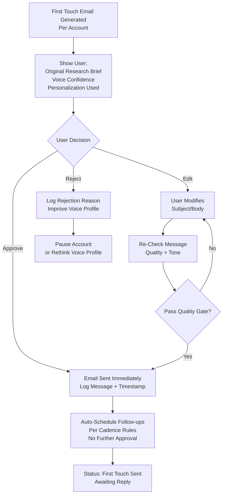

**Steps**:
1. System generates first touch email based on research brief and voice profile
2. Display to user:
   - Original research brief (company news, hiring signals, pain indicators)
   - Voice cloning confidence score
   - Personalization techniques used (e.g., "funding news", "product fit")
3. **User decision**:
   - **Approve**: Send immediately, log message, advance to follow-up scheduling
   - **Edit**: Modify subject/body; system re-validates for tone/quality; resubmit
   - **Reject**: Log reason, flag for voice profile improvement, pause account
4. After approval: auto-schedule follow-ups per cadence (e.g., 3 days, 7 days)
5. Status: "first_touch_sent" → monitor for replies

---

### D. Reply Handling Flow (L2 Autonomy)

**Duration**: ~2 minutes per reply (escalations) | **Autonomy**: Auto-handles 40–50% of replies

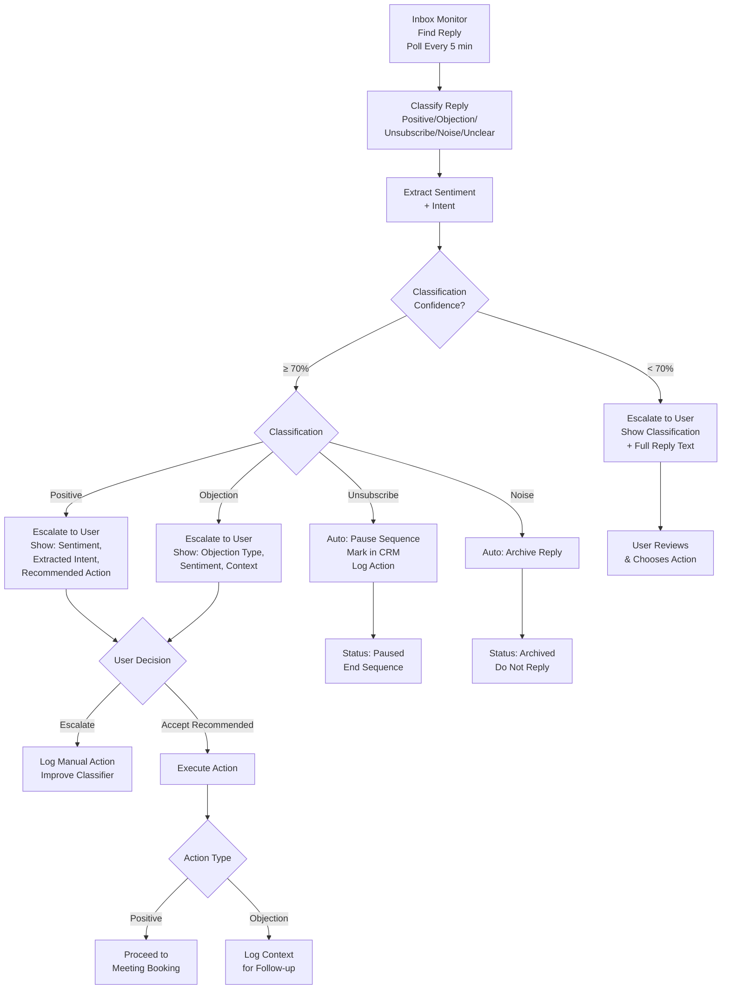

**Steps**:
1. Inbox monitor polls every 5 minutes for inbound replies
2. Classify reply:
   - **Positive**: Shows interest or willingness to discuss
   - **Objection**: Raises concern (price, timing, fit, competitor)
   - **Unsubscribe**: Explicit opt-out ("stop emailing")
   - **Noise**: Out-of-office, bounce, spam complaint
   - **Unclear**: Classification uncertain (low confidence)
3. Extract sentiment and intent from reply
4. **Decision point**:
   - **Confidence ≥ 70%**:
     - Unsubscribe → Auto-pause sequence, mark in CRM
     - Noise → Auto-archive
     - Positive/Objection → Escalate to user (show confidence, context, recommended action)
   - **Confidence < 70%** → Always escalate to user
5. **User action**:
   - Accept recommendation → Execute (book meeting for positive, prepare rebuttal for objection)
   - Override → Log reason, improve classifier
6. Log all actions and reasoning

---

### E. Meeting Booking Flow

**Duration**: ~3 minutes | **Autonomy**: System proposes, user/prospect confirms

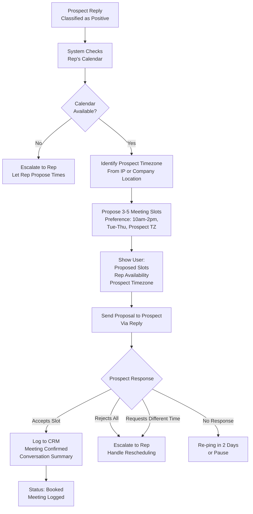

**Steps**:
1. Prospect sends positive reply
2. System checks rep's calendar availability (read via Google Calendar API or Outlook)
3. **Decision**: If calendar unavailable, escalate to rep for manual proposal
4. Detect prospect timezone (via IP geolocation or inferred from company location)
5. Propose 3–5 meeting slots:
   - Preferred times: 10:00 AM – 2:00 PM local time
   - Preferred days: Tuesday–Thursday
   - Show slots in prospect's timezone
6. Display proposal to user (show slots, rep availability, prospect timezone)
7. Send proposal to prospect via email reply
8. **Prospect decision**:
   - Accepts slot → Log to CRM with conversation summary, status = "booked"
   - Rejects/requests different time → Escalate to rep (manual handling)
   - No response → Re-ping in 2 days or pause sequence
9. Status: "booked" → conversation context and next steps logged

---

### F. Dashboard Flow

**Duration**: Always available | **Autonomy**: Visibility and control

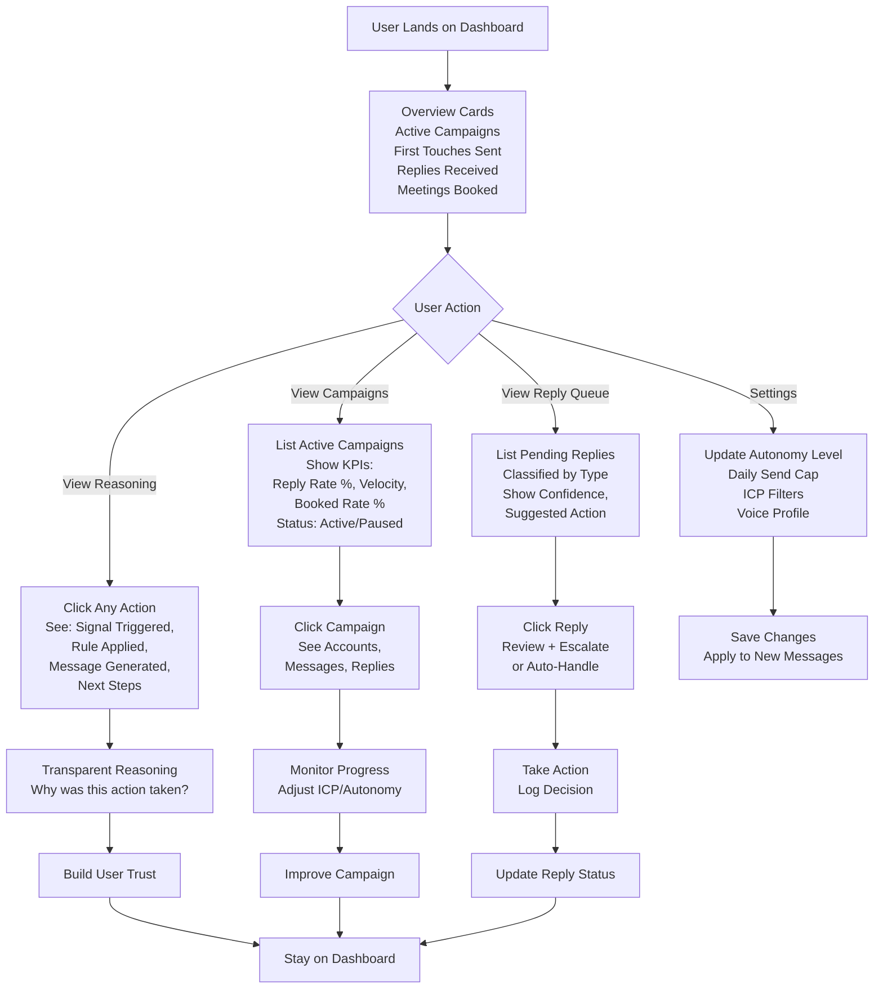

**Dashboard Components**:
1. **Overview Cards**:
   - Active campaigns count + recent status
   - First touches sent (this month/all-time)
   - Replies received (pending/handled)
   - Meetings booked (this month/pipeline)

2. **Active Campaigns**:
   - List view: name, ICP, status, KPIs
   - KPIs: reply rate %, meeting rate %, velocity (touches/day)
   - Click to drill into campaign details (accounts, messages, replies)

3. **Reply Queue**:
   - Pending replies awaiting action
   - Show: reply text, classification, confidence, suggested action
   - Click to escalate or execute auto-action
   - Filter by classification (positive, objection, unclear, etc.)

4. **Reasoning Log**:
   - Click any message, reply, or action to see explanation
   - Show: what signal triggered it, what rule applied, why this action
   - Build trust through transparency (Section 6.3 in tech-spec)

5. **Settings**:
   - Autonomy level (L1/L2/L3/L4)
   - Daily send cap (default 20, per-domain cap 5)
   - ICP filters (global defaults)
   - Voice profile (select, edit, or create new)

---

## 3. Error & Edge Case Flows

### Email Send Failure

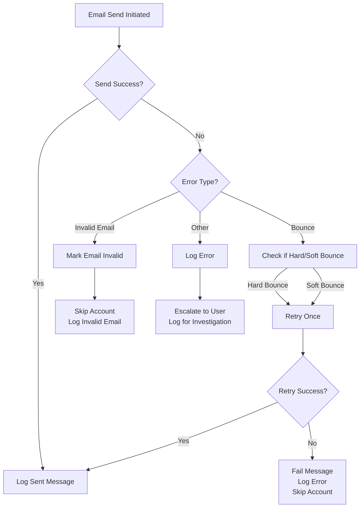

**Logic**:
- Send email via SMTP
- If send fails (bounce, invalid, timeout):
  - Retry once after 1 minute
  - If retry succeeds, log as sent
  - If retry fails, log as failed, skip account, notify user if pattern emerges

---

### OAuth Disconnection

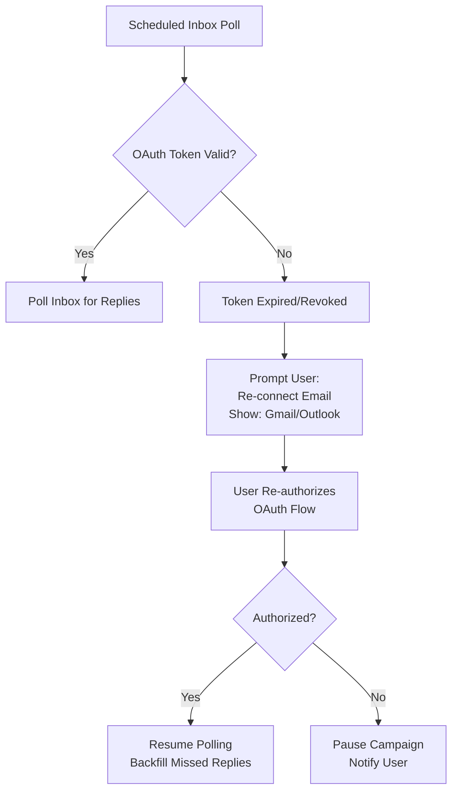

**Logic**:
- When polling inbox, check token validity
- If invalid/expired, interrupt polling and show user re-connect prompt
- User re-authorizes via OAuth2 flow (Gmail, Outlook, or custom IMAP)
- Resume polling and backfill any missed replies since disconnect

---

### Inbox Polling Timeout

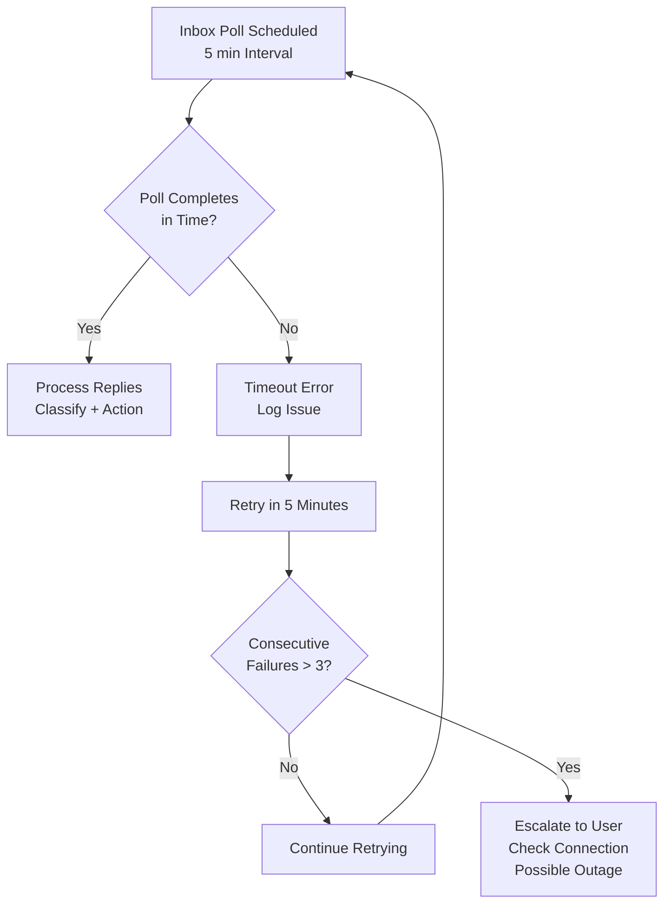

**Logic**:
- Poll inbox every 5 minutes
- If poll times out, log error and retry in 5 minutes
- If 3+ consecutive timeouts, escalate to user (possible API outage or connection issue)
- Do not pause campaign; keep retrying with backoff

---

### Calendar API Unavailable

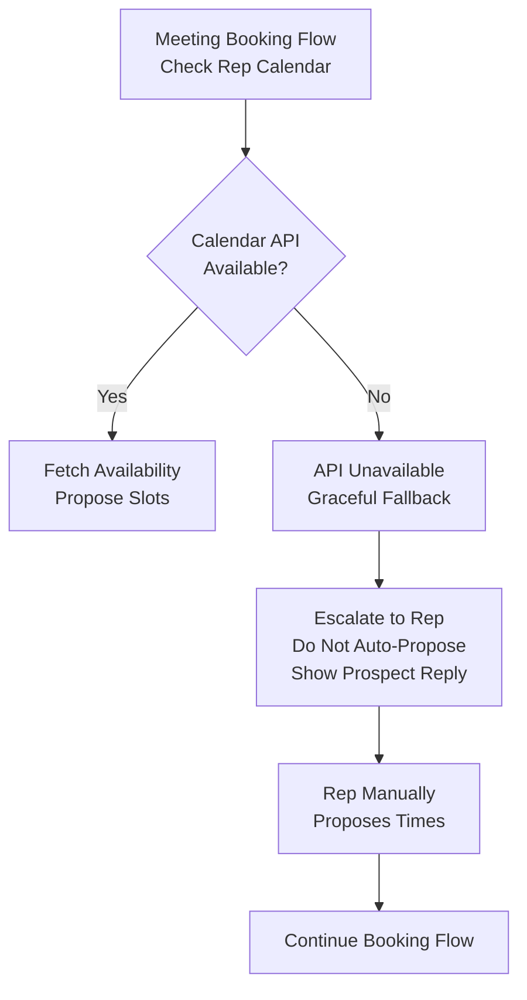

**Logic**:
- If calendar API is down, do not attempt to auto-propose slots
- Escalate to rep with prospect reply and context
- Rep manually suggests times and sends proposal
- System logs when calendar was unavailable; no auto-booking for this prospect

---

### CSV Upload Validation

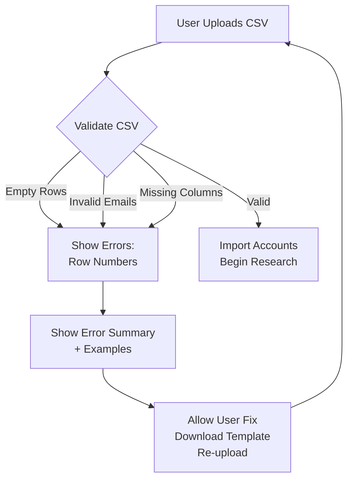

**Logic**:
- Validate CSV on upload: check for empty rows, invalid email format, required columns
- Show user errors with line numbers and examples
- Allow re-upload after fixing
- Once valid, import and begin research phase

---

### Voice Profile Confidence Too Low

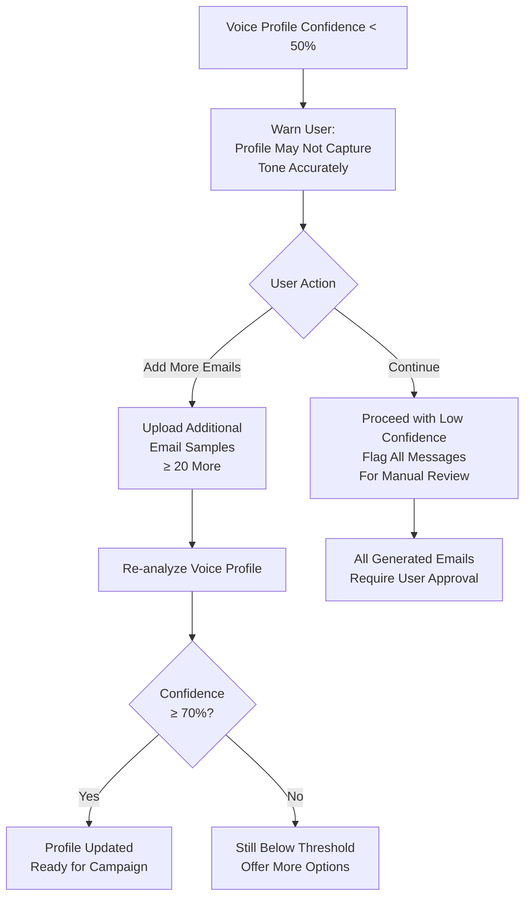

**Logic**:
- If voice profile confidence < 50%, warn user
- Offer two paths:
  1. Add more email samples (20+) and re-analyze
  2. Proceed but flag all generated emails for user review (no auto-send)
- Retry analysis after adding emails
- If still < 70%, recommend discontinuing or using L1 autonomy (human approval all)

---

## 4. Outreach State Machine

**All possible states for an Outreach object**:

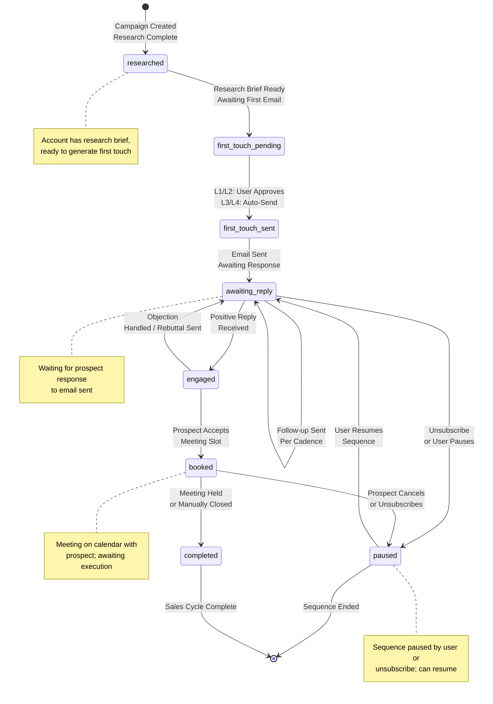

**State Transitions**:
1. **researched** → first_touch_pending: Research phase complete, brief generated
2. **first_touch_pending** → first_touch_sent: User approves (L1/L2) or system auto-sends (L3/L4)
3. **first_touch_sent** → awaiting_reply: Email delivered, monitoring for responses
4. **awaiting_reply** → engaged: Positive reply classified
5. **awaiting_reply** → paused: Unsubscribe received or user manually pauses
6. **awaiting_reply** → awaiting_reply: Follow-up auto-sent per cadence (cycle continues)
7. **engaged** → booked: Prospect accepts meeting proposal
8. **engaged** → awaiting_reply: Objection rebuttal sent; continue conversation
9. **booked** → completed: Meeting held or opportunity closed
10. **paused** → awaiting_reply: User resumes sequence
11. **paused** → [*]: Sequence ended (final unsubscribe or user decision)

---

## 5. Integration Touchpoints

### Email Service (SMTP / OAuth2)
- **Outbound**: SMTP via rep's domain or sender alias
- **Inbound**: OAuth2 to Gmail/Outlook for reply monitoring
- **Compliance**: SPF/DKIM validation, bounce handling, daily/domain caps
- **Trigger**: Every outreach action

### Calendar Service (Google Calendar / Outlook)
- **Read**: Fetch rep availability for meeting proposals
- **Write**: Log booked meetings to rep's calendar
- **Fallback**: If API unavailable, escalate to rep
- **Trigger**: When prospect reply is positive

### CRM Integration (HubSpot / Salesforce)
- **Write**: Log booked meetings with conversation summary and next steps
- **Read**: Optional, to enrich account context (Phase 2+)
- **Sync**: Batch writes after booking; real-time in Phase 2+
- **Trigger**: When meeting confirmed

### Data Enrichment (Phase 2+)
- LinkedIn, Crunchbase, BuiltWith, etc.
- Fetch org charts, funding signals, tech stack
- Feed into research briefs
- Trigger: Campaign creation or real-time signal monitoring

---

## 6. Key Metrics & Monitoring

**Per-Campaign KPIs**:
- **Reply Rate**: Replies received ÷ first touches sent (target ≥15%)
- **Meeting Rate**: Meetings booked ÷ replies received (target ≥20%)
- **Velocity**: Touches sent per day (configurable, default 5–20/day)
- **Confidence Scores**: Voice profile, reply classification, message quality

**System Health**:
- Email send success rate (target ≥98%)
- Inbox polling uptime (target ≥99%)
- Reply classification accuracy (target ≥90%)
- Spam complaint rate (target <0.1%)

**User Engagement**:
- % of users viewing reasoning log (target ≥80%)
- % of users editing/rejecting messages (engagement indicator)
- % of users adjusting ICP/autonomy level (customization)

---

## Appendix: Decision Tree Quick Reference

| Scenario | Autonomy L1 | L2 | L3 | L4 |
|----------|---|---|---|---|
| **First Touch** | Approve all | User approves | Auto-send | Auto-send |
| **Follow-ups** | Approve all | Auto-send | Auto-send | Auto-send |
| **Positive Reply** | Escalate | Escalate to user; system proposes slots | System proposes slots | System books meeting |
| **Objection** | Escalate | Escalate + context | Auto-rebuttal if confident | Auto-rebuttal |
| **Unsubscribe** | Escalate | Auto-pause | Auto-pause | Auto-pause |
| **Noise** | Escalate | Auto-archive | Auto-archive | Auto-archive |
| **Unclear** | Escalate | Escalate | Escalate | Escalate if confidence < 70% |

---

**End of Document**

---

*This App Flow document serves as a reference for frontend design, backend workflow orchestration, and user experience validation. For implementation details, refer to technical-spec.md Sections 2–4.*
