# Autonomous BDR — Technical Specification (Visual Edition)

## Executive Summary

The Autonomous BDR is an AI-powered agent that automates the full outbound sales cycle: sourcing leads, personalizing outreach, handling replies, and booking meetings. The product operates across multiple autonomy levels (L1-L4) with human review gates, starting with email-only, bring-your-own-list (BYOL) mode at L2 autonomy.

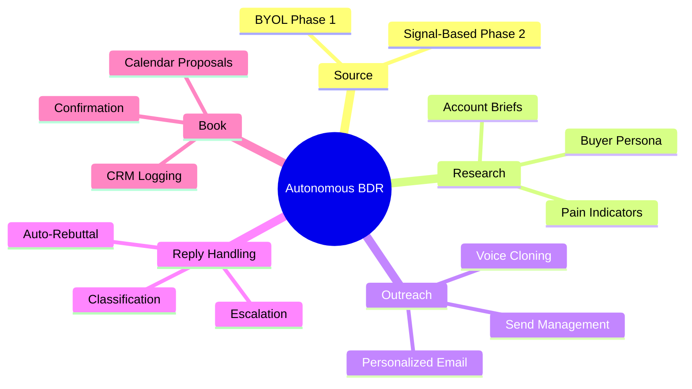

---

## 1. Vision & Scope

### Product Goals
- **Primary Goal**: Enable early-stage startups and SDR teams to run autonomous outbound without hiring new reps
- **Success Metric**: 5-10x improvement in outbound efficiency by eliminating non-selling tasks
- **Key Enabler**: LLM-powered voice cloning from existing rep emails, enabling personalized scale

### Target Users (Phase 1)
- **Primary**: Founders doing their own outbound at early-stage startups
- **Secondary**: SDR teams at scale-ups (for future phases)

### Out of Scope (Phase 1)
- Multi-channel outreach (LinkedIn, phone)
- Lead sourcing/discovery
- CRM integration beyond basic meeting logging
- Native phone calling

---

## 2. Core Feature Specification

### 2.1 Five-Stage Core Loop

The core loop moves each prospect through five sequential stages. The diagram below shows the full pipeline with decision points controlled by autonomy level.

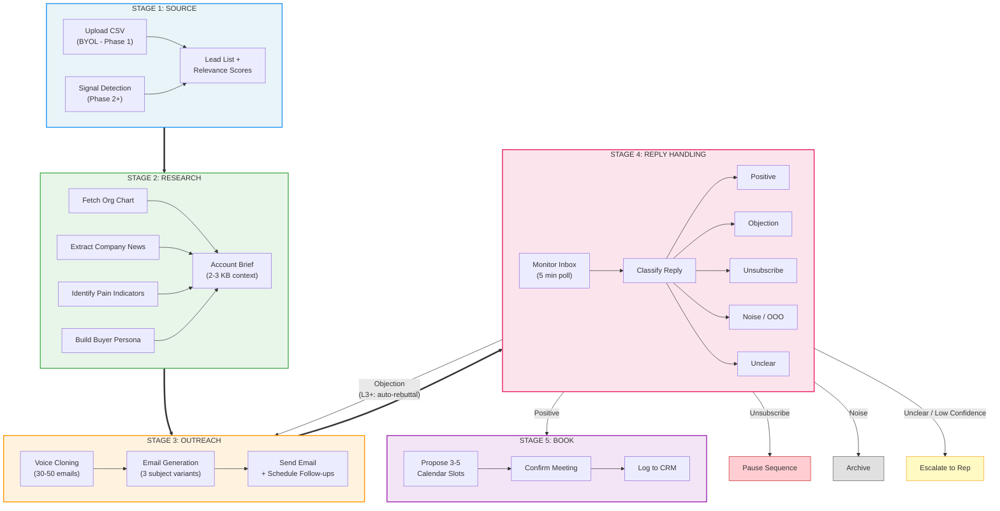

---

#### Stage 1: Source
**Status**: BYOL only in Phase 1. Sourcing enabled in Phase 2.

**Responsibilities (Phase 2+)**:
- Monitor job boards (LinkedIn, Angellist, hiring signals)
- Track funding announcements (Crunchbase, PitchBook)
- Detect hiring signals via LinkedIn job postings
- Identify tech-stack changes (BuiltWith, G2)

**Inputs**: ICP definition (company size, industry, tech stack, revenue signals)
**Outputs**: Lead list with relevance score, data freshness timestamp

**Phase 1 workaround**: Users upload CSV with target accounts

---

#### Stage 2: Research
**Status**: Core feature for Phase 1

**Responsibilities**:
- Fetch public org chart from LinkedIn/Hunter/Apollo
- Extract recent company news (Crunchbase, Twitter, press releases)
- Identify pain indicators (tech stack analysis, hiring patterns, funding stage)
- Build persona read on buyer (role, seniority, likely goals)
- Assemble per-account brief (max 2-3 KB context)

**Inputs**: Account domain, company name, known buyer email (optional)
**Outputs**:
```json
{
  "account_id": "str",
  "company_name": "str",
  "research_brief": {
    "org_chart_snapshot": ["name", "title", "linkedin_url"],
    "recent_news": ["headline", "date", "source_url"],
    "pain_indicators": ["signal", "confidence", "date"],
    "buyer_persona": {"role": "", "seniority": "", "likely_goals": []},
    "icp_fit_score": 0.85,
    "data_freshness": "timestamp"
  },
  "recommended_buyer": "email@domain.com"
}
```

---

#### Stage 3: Outreach
**Status**: Core feature for Phase 1

**Email Generation Pipeline**:

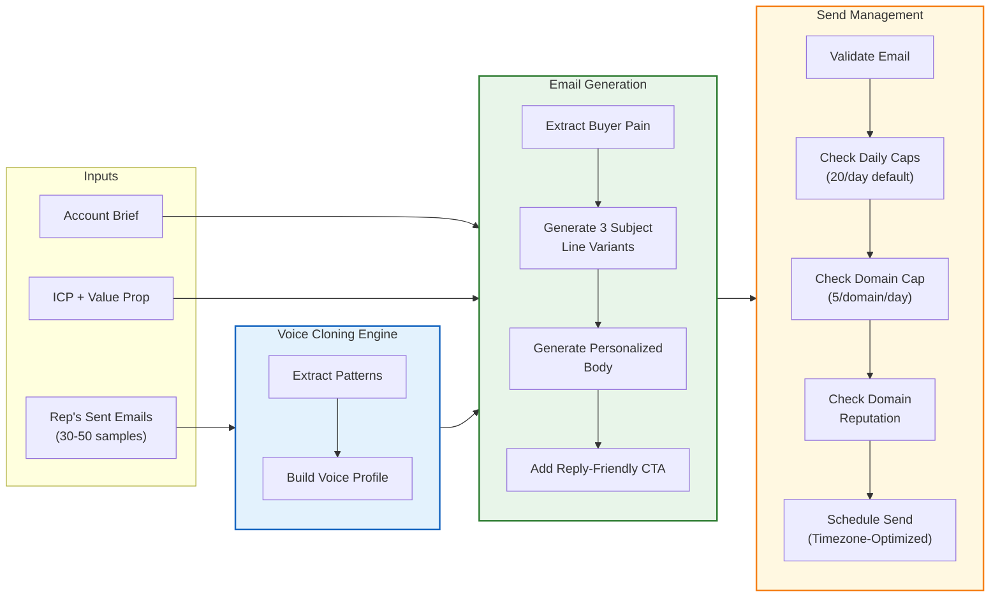

**Voice Cloning Outputs**:
```json
{
  "voice_profile": {
    "tone": "str (e.g., 'direct, data-driven, casual')",
    "sentence_structure": "str (e.g., 'short punchy lines')",
    "sign_off_pattern": "[str, ...]",
    "emoji_usage": "bool",
    "avg_message_length": "int (words)",
    "common_openers": "[str, ...]",
    "value_prop_style": "str",
    "confidence_score": 0.88
  }
}
```

**Sending Rules**:
- Respect daily send cap (default: 20/day, configurable)
- Respect per-domain send cap (default: 5/domain/day)
- Skip if domain reputation is flagged
- Skip if email fails validation
- Log send timestamp, recipient, full message body

---

#### Stage 4: Reply Handling — State Machine

The reply handler classifies inbound messages and routes them through a state machine that adapts behavior by autonomy level.

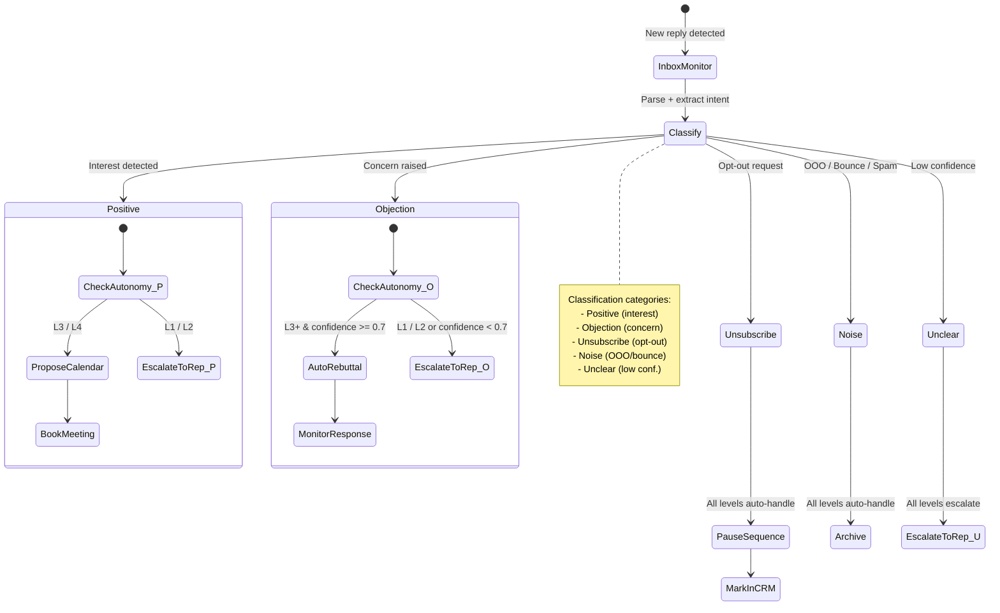

**Reply Classification Outputs**:
```json
{
  "reply_id": "str",
  "received_timestamp": "datetime",
  "sender_email": "str",
  "classification": "positive|objection|unsubscribe|noise|unclear",
  "confidence": 0.92,
  "objection_type": "str (if applicable, e.g., 'already_using_competitor')",
  "extracted_sentiment": "str",
  "recommended_action": "escalate|auto_rebuttal|pause_sequence|book_meeting",
  "reasoning_log": "str (explain why this classification)"
}
```

---

#### Stage 5: Book
**Status**: Core feature for Phase 1

**Process**:
1. Extract availability from rep's calendar (read via API or manual spec)
2. Identify prospect timezone (from IP or inferred from company)
3. Propose 3-5 meeting slots (preference: 10 AM-2 PM local time, Tuesday-Thursday)
4. Log proposal in CRM
5. Monitor for acceptance/rejection/reschedule
6. Auto-confirm or escalate if prospect pushes back

**Meeting Log Output** (to CRM):
```json
{
  "opportunity_id": "str",
  "account_name": "str",
  "contact_email": "str",
  "meeting_scheduled": "datetime",
  "meeting_source": "autonomous_bdr",
  "conversation_context": "str (summary of all prior exchanges)",
  "next_action": "str (rep's suggested follow-up)",
  "confidence_score": 0.85
}
```

---

### 2.2 Autonomy Levels

The four autonomy levels form a spectrum from fully human-supervised to fully autonomous. Each level unlocks more automated actions while accepting more risk.

```mermaid
flowchart LR
    subgraph L1["L1: DRAFT MODE"]
        direction TB
        l1a["Agent drafts everything"]
        l1b["Human sends EVERY message"]
        l1c["Risk: LOW"]
        l1d["Complexity: LOW"]
    end

    subgraph L2["L2: FIRST TOUCH APPROVAL"]
        direction TB
        l2a["Human approves first touch"]
        l2b["Auto follow-ups"]
        l2c["Auto unsubscribe/noise"]
        l2d["Risk: LOW-MED"]
        l2e["Complexity: MEDIUM"]
    end

    subgraph L3["L3: AUTO-SEND"]
        direction TB
        l3a["All outreach auto-sent"]
        l3b["Human reviews replies only"]
        l3c["Auto-rebuttal if conf >= 0.7"]
        l3d["Risk: MEDIUM"]
        l3e["Complexity: HIGH"]
    end

    subgraph L4["L4: FULLY AUTONOMOUS"]
        direction TB
        l4a["End-to-end autonomous"]
        l4b["Self-assess readiness"]
        l4c["Context-aware rebuttals"]
        l4d["Risk: HIGH"]
        l4e["Complexity: HIGHEST"]
    end

    L1 --> L2 --> L3 --> L4

    style L1 fill:#e8f5e9,stroke:#4CAF50,stroke-width:3px,color:#1B5E20
    style L2 fill:#e3f2fd,stroke:#2196F3,stroke-width:3px,color:#0D47A1
    style L3 fill:#fff3e0,stroke:#FF9800,stroke-width:3px,color:#E65100
    style L4 fill:#fce4ec,stroke:#E91E63,stroke-width:3px,color:#880E4F
```

#### Autonomy Decision Tree

Use this decision tree to recommend the appropriate autonomy level for a given customer.

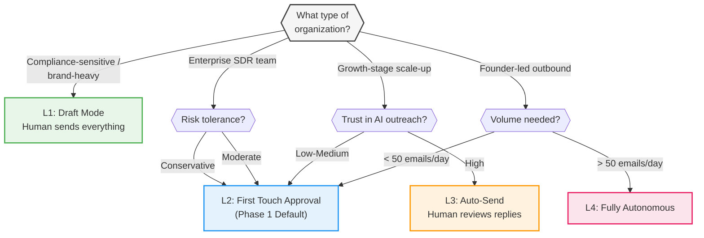

| Level | Approval Model | Best For | Risk | Implementation Complexity |
|-------|---|---|---|---|
| **L1** | Agent drafts everything; human sends every message | Compliance-sensitive, brand-heavy orgs | Low | Low |
| **L2** | Agent auto-follows up; human approves first touch only | Most enterprise SDR teams (Phase 1 default) | Low-Med | Medium |
| **L3** | All outreach auto-sent; human reviews replies only | Growth-stage scale-ups | Med | High |
| **L4** | Fully autonomous end-to-end | Founder-led outbound (Phase 1 option) | High | Highest |

**Phase 1 Default**: L2 (safe, saves time, builds trust)

---

### 2.3 Style Cloning Feasibility Matrix

The following chart visualizes the feasibility and phasing of each style-cloning capability. Higher bars indicate greater feasibility; color indicates the target implementation phase.

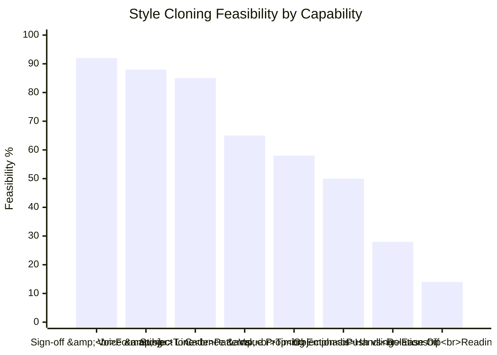

| Capability | Data Needed | Feasibility | Difficulty | Phase |
|---|---|---|---|---|
| Voice & tone | ~30-50 sent emails | 88% | Easy | 1 |
| Subject line patterns | ~20 sent emails | 85% | Easy | 1 |
| Sign-off & formatting | ~10 sent emails | 92% | Easy | 1 |
| Cadence & follow-up timing | Emails + CRM timestamps | 65% | Medium | 2 |
| Value prop emphasis | Emails + win/loss data | 58% | Medium | 2 |
| Objection handling style | Reply threads + call transcripts | 50% | Medium | 2 |
| When to push vs. ease off | Requires outcome labels | 28% | Hard | 3 |
| Relationship reading | Likely not learnable | 14% | Hard | N/A (skip) |

**Phase 1 Baseline**: Voice + tone, subject lines, sign-off, formatting. Sufficient for 85%+ human-quality perception.

---

## 3. Technical Architecture

### 3.1 System Components

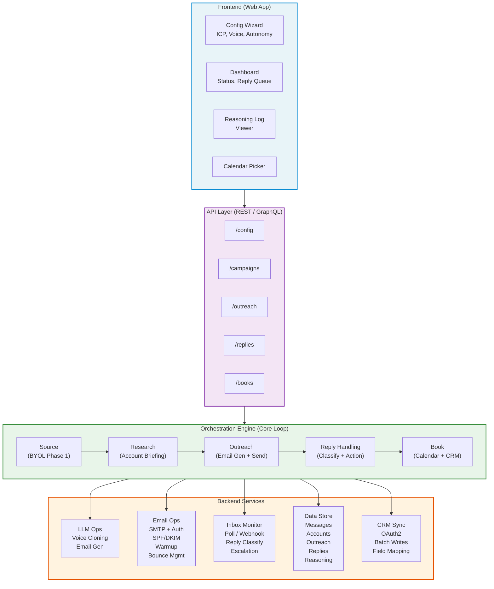

---

### 3.2 Data Flow (Core Loop)

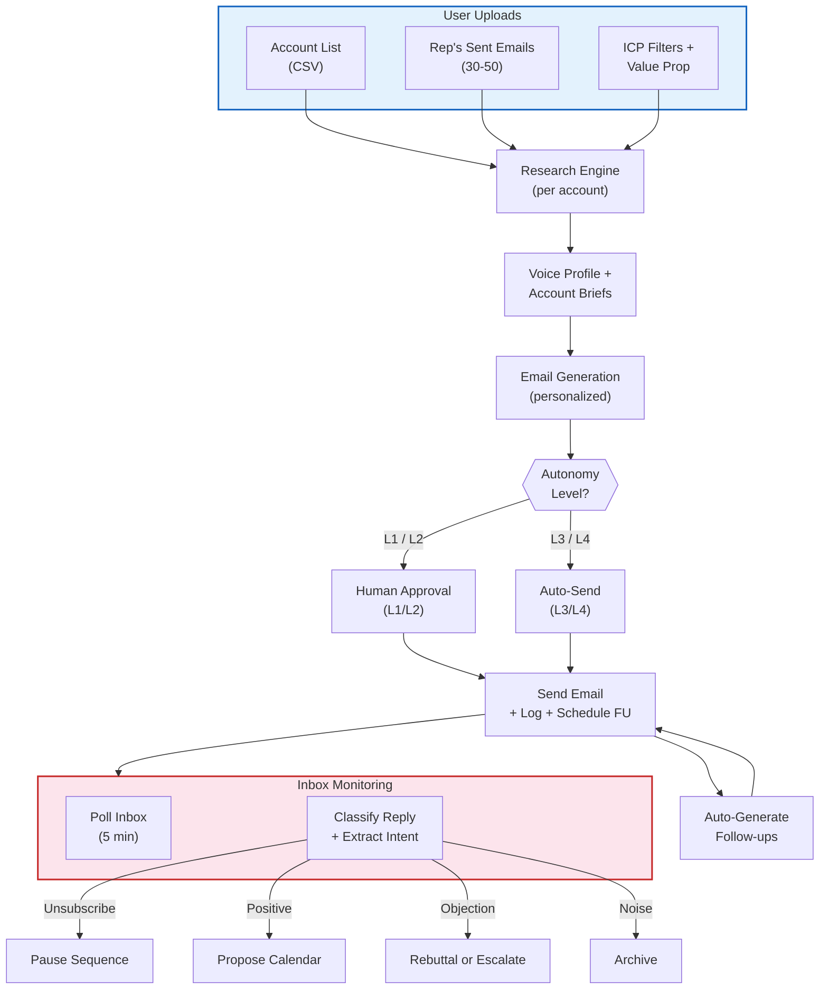

---

### 3.3 Data Models — Entity Relationship Diagram

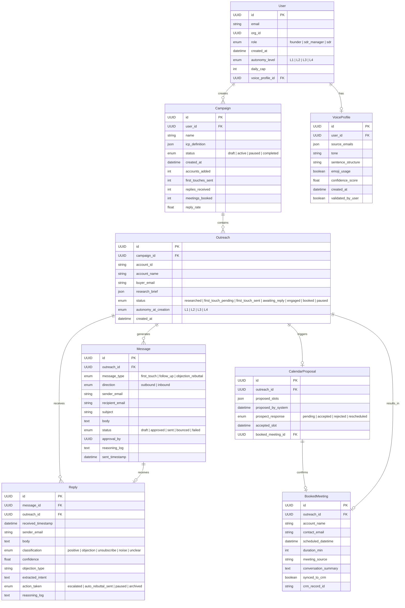

---

## 4. Integration Points

### Integration Topology

```mermaid
flowchart TB
    subgraph BDR["Autonomous BDR Platform"]
        core["Orchestration<br/>Engine"]
    end

    subgraph EmailSvc["Email Services"]
        smtp["SMTP<br/>(Rep's domain / alias)"]
        inbox_oauth["Inbox OAuth2<br/>(Gmail / Outlook / IMAP)"]
        deliverability["Deliverability<br/>SPF / DKIM / Bounce"]
    end

    subgraph CalSvc["Calendar Services"]
        gcal["Google Calendar"]
        outlook_cal["Outlook Calendar"]
        tz["Timezone Detection<br/>(IP / Company Location)"]
    end

    subgraph CRMSvc["CRM Integration (Phase 1: Optional)"]
        hubspot["HubSpot"]
        salesforce["Salesforce"]
        crm_sync["OAuth2 + Batch Writes"]
    end

    subgraph DataAPIs["Data Enrichment APIs (Phase 2+)"]
        jobs["Job Boards<br/>LinkedIn, Angellist, Indeed"]
        funding["Funding Signals<br/>Crunchbase, PitchBook"]
        tech["Tech Stack<br/>BuiltWith, G2"]
        emailfind["Email Finder<br/>Hunter, RocketReach, Apollo"]
    end

    core <-->|"Send outreach"| smtp
    core <-->|"Read replies"| inbox_oauth
    core <-->|"Validate"| deliverability
    core <-->|"Read availability<br/>/ Auto-book"| gcal & outlook_cal
    core -->|"Detect TZ"| tz
    core -->|"Log meetings"| crm_sync
    crm_sync --> hubspot & salesforce
    core <-->|"Enrich accounts"| jobs & funding & tech & emailfind

    style BDR fill:#e8f5e9,stroke:#2E7D32,stroke-width:3px
    style EmailSvc fill:#e3f2fd,stroke:#1565C0,stroke-width:2px
    style CalSvc fill:#f3e5f5,stroke:#7B1FA2,stroke-width:2px
    style CRMSvc fill:#fff3e0,stroke:#E65100,stroke-width:2px
    style DataAPIs fill:#fce4ec,stroke:#C62828,stroke-width:2px
```

### 4.1 Email Service Integration
- **SMTP**: Send outreach (rep's domain or sender alias)
- **Inbox Monitoring**: OAuth2 to read inbound replies (Gmail, Outlook, or custom IMAP)
- **Deliverability**: SPF/DKIM validation, bounce handling, domain reputation checks

### 4.2 Calendar Integration
- **Google Calendar** or **Outlook**: Read rep availability, auto-book slots
- **Timezone detection**: Via prospect's IP or company location

### 4.3 CRM Integration (Phase 1: Optional)
- **Supported**: HubSpot, Salesforce (basic logging)
- **Data flow**: Booked meeting -> create/update CRM record with full context
- **Approach**: OAuth2, batch writes (Phase 1), real-time (Phase 2+)

### 4.4 Data Enrichment APIs (Phase 2+)
- **Job boards**: LinkedIn, Angellist, Indeed
- **Funding signals**: Crunchbase, PitchBook
- **Tech stack**: BuiltWith, G2
- **Email finder**: Hunter, RocketReach, Apollo

---

## 5. Security & Compliance

### Compliance Framework Overview

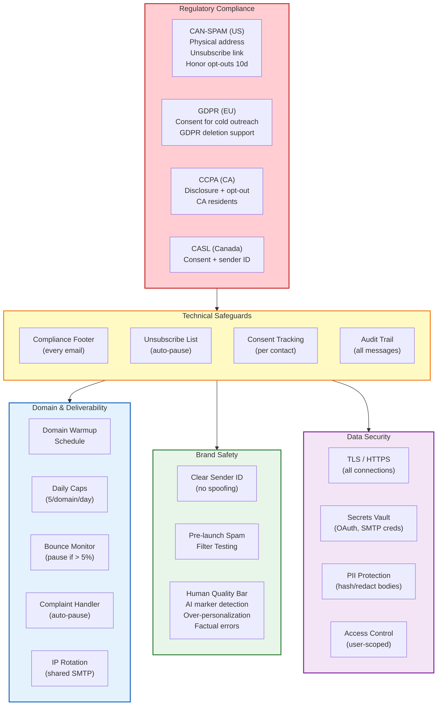

### 5.1 Email Compliance
- **CAN-SPAM** (US): Provide physical address, clear unsubscribe, honor opt-outs within 10 days
- **GDPR** (EU): Consent requirement for cold outreach (except B2B under some conditions); respect GDPR deletion
- **CCPA** (CA): Disclosure + opt-out for CA residents
- **CASL** (Canada): Consent + clear identification of sender

**Implementation**:
- Add compliance footer (physical address, unsubscribe link) to every email
- Maintain unsubscribe list; pause agent on any unsubscribe
- Log consent status per contact
- Provide audit trail of all messages sent (for regulatory review)

### 5.2 Domain & Deliverability Safety
- **Domain warmup**: Manual or auto-warmup schedule before first outreach (avoid spam folder)
- **Daily caps**: Strict limits per domain (default: 5 emails/domain/day)
- **Bounce monitoring**: Skip bounced emails; pause domain if bounce rate > 5%
- **Complaint handling**: Pause domain on any spam complaint; escalate to user
- **IP rotation**: If using shared SMTP, rotate IPs for each domain

### 5.3 Brand Safety
- **Sender identification**: Every email clearly identifies the company and rep name (no spoofing)
- **Spam filter testing**: Pre-launch testing via Mail Tester, GlockApps
- **Human quality bar**: Generated emails must pass human review (L1/L2) or auto-validation against red flags:
  - Obvious AI markers ("As an AI", repetitive phrases)
  - Over-personalization (appears stalking-like)
  - Factual errors in research brief

### 5.4 Data Security
- **Encryption**: TLS for all SMTP/IMAP, HTTPS for API
- **Secrets**: OAuth tokens, SMTP creds stored in secure vault (Vault, AWS Secrets Manager)
- **PII handling**: Do not log email bodies in cleartext; hash or redact for analytics
- **Access control**: User can only see/manage their own campaigns + messages

---

## 6. UI/UX Requirements

### 6.1 Onboarding Flow

```mermaid
flowchart LR
    s1["1. Sign Up<br/>Email + Password"]
    s2["2. Connect Email<br/>OAuth2<br/>Gmail / Outlook"]
    s3["3. Define ICP<br/>Industry, Size,<br/>Tech Stack, Pain"]
    s4["4. Set Value Prop<br/>1-2 Key<br/>Differentiators"]
    s5["5. Clone Voice<br/>Upload 30-50<br/>Rep Emails"]
    s6["6. Choose Autonomy<br/>L1-L4<br/>(Default: L2)"]
    s7["7. Upload Leads<br/>CSV with<br/>Account Domains"]
    s8["8. Review First Email<br/>(L1/L2)<br/>Approve Template"]

    s1 --> s2 --> s3 --> s4 --> s5 --> s6 --> s7 --> s8

    style s1 fill:#e3f2fd,stroke:#1565C0
    style s2 fill:#e3f2fd,stroke:#1565C0
    style s3 fill:#e8f5e9,stroke:#2E7D32
    style s4 fill:#e8f5e9,stroke:#2E7D32
    style s5 fill:#fff3e0,stroke:#E65100
    style s6 fill:#fff3e0,stroke:#E65100
    style s7 fill:#f3e5f5,stroke:#7B1FA2
    style s8 fill:#f3e5f5,stroke:#7B1FA2
```

### 6.2 Core Dashboard
- **Status overview**: Accounts in pipeline, first touches sent, replies received, meetings booked
- **Active campaigns**: List with KPIs (reply rate, meeting rate, velocity)
- **Reply queue**: Pending replies (with classification + suggested action)
- **Reasoning log**: Click any action to see why the system made that decision
- **Settings panel**: Update autonomy level, daily caps, ICP, voice profile

### 6.3 Transparency Features (Critical for Trust)
Every outreach action should show:
- **What signal triggered this?** (e.g., "Prospect company just raised Series B")
- **What rule applied?** (e.g., "Match ICP: SaaS, Series B, 50-200 employees")
- **Why this message?** (e.g., "Voice profile: casual, direct; personalizations: funding news, product fit")
- **What's next?** (e.g., "Follow-up scheduled for 3 days if no reply")

---

## 7. Implementation Roadmap

### Phase Timeline (Gantt)

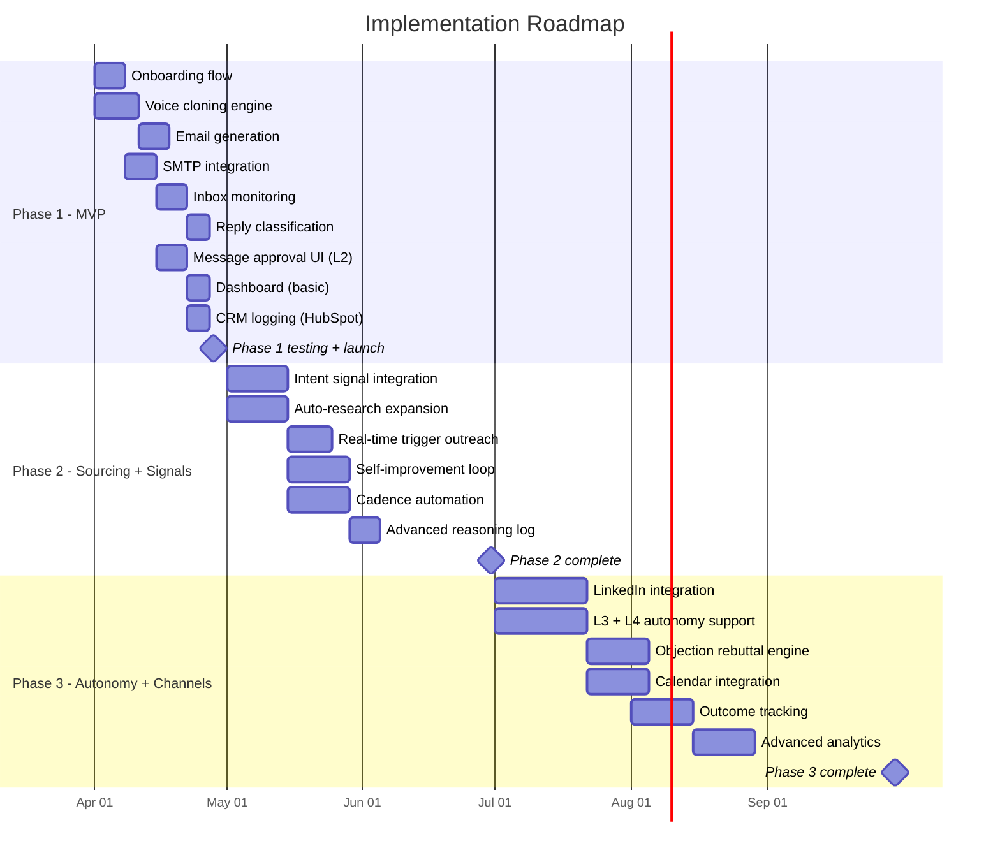

### Phase 1: MVP (Weeks 1-4)
**Goal**: Email-only, BYOL, L2 autonomy. Prove core loop works.

**Deliverables**:
- [ ] Onboarding flow (ICP, voice cloning, email connection)
- [ ] Voice cloning engine (extract tone, templates from 30-50 emails)
- [ ] Email generation (personalized first touches)
- [ ] SMTP integration (send + bounce handling)
- [ ] Inbox monitoring (poll Gmail/Outlook for replies)
- [ ] Reply classification (positive, objection, unsubscribe, noise)
- [ ] Message approval UI (L2 only first touch)
- [ ] Dashboard (basic: sent, replied, pending)
- [ ] CRM logging (basic: booked meetings to Hubspot)

**Success Criteria**:
- Reply rate >= 15% (human-written email baseline)
- 90% accuracy on reply classification
- Zero spam complaints in first 100 emails sent

---

### Phase 2: Sourcing + Signals (Months 2-3)
**Goal**: Add lead sourcing + real-time signal response.

**Deliverables**:
- [ ] Intent signal integration (funding, hiring, job changes via API)
- [ ] Auto-research expansion (expand beyond uploaded list)
- [ ] Real-time trigger outreach (new signal -> email in minutes)
- [ ] Self-improvement loop (track which messages get replies, optimize)
- [ ] Cadence automation (multi-touch sequences, timed follow-ups)
- [ ] Advanced reasoning log (show which signals + data sources drove decision)

**Success Criteria**:
- 5x higher reply rate on real-time signal emails vs. cold outreach
- Self-improvement loop measurably improves reply rate by 10%+ over 30 days

---

### Phase 3: Autonomy + Channels (Months 4-6)
**Goal**: Add LinkedIn, raise autonomy, self-improving loop.

**Deliverables**:
- [ ] LinkedIn integration (sourcing + outreach + replies)
- [ ] Autonomy L3 + L4 support (auto-send, handle replies end-to-end)
- [ ] Objection rebuttal engine (context-aware responses to common objections)
- [ ] Calendar integration (auto-propose slots, handle rescheduling)
- [ ] Outcome tracking (win/loss labels to improve voice cloning)
- [ ] Advanced analytics (cohort analysis: which ICPs, personas, messages perform best)

**Success Criteria**:
- Objection rebuttal accuracy >= 80% (prospects respond positively)
- 40%+ of booked meetings closed (with CRM attribution)
- Support for L3/L4 with <5% of users opting for fully autonomous mode initially

---

## 8. Known Risks & Mitigations

### Risk Landscape

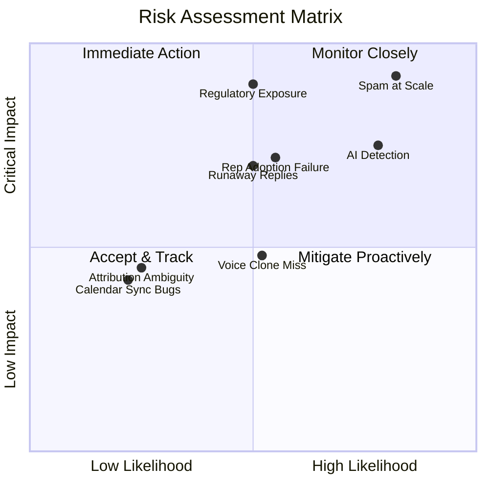

| Risk | Likelihood | Impact | Mitigation |
|---|---|---|---|
| **Spam at scale** | High | Critical | Daily caps, bounce monitoring, auto-pause on complaints. Pre-launch testing. |
| **"Obviously AI" detection** | High | High | Human-quality bar in approval. Randomize formatting/signing. Train on human emails. |
| **Regulatory exposure** | Medium | Critical | Compliance footer, consent tracking, unsubscribe handling, audit trail. Geo-fence initially (US only). |
| **Rep adoption failure** | Medium | High | Transparent reasoning log (glass box). Approval gates (L2 default). Weekly digest for non-users. |
| **Runaway reply handling** | Medium | High | Conservative classifier. Escalate on low confidence. Manual review of "unsubscribe" handling. |
| **Attribution ambiguity** | Low | Medium | Tag every booking with source. CRM logging. Weekly report to user. |
| **Calendar sync bugs** | Low | Medium | Extensive testing. Manual confirmation flow for first 3 bookings. |
| **Voice cloning misses rep style** | Medium | Medium | 50-email minimum. User can curate samples. Allow manual override of voice profile. |

---

## 9. Success Metrics (by Phase)

```mermaid
flowchart LR
    subgraph P1["Phase 1 Metrics"]
        direction TB
        p1a["50+ pilot users"]
        p1b[">80% send >= 1 touch"]
        p1c["Reply rate >= 15%"]
        p1d["Zero spam complaints"]
        p1e[">80% view reasoning log"]
    end

    subgraph P2["Phase 2 Metrics"]
        direction TB
        p2a["5x reply rate<br/>on signal emails"]
        p2b["10%+ reply rate<br/>improvement / 30d"]
        p2c[">60% Phase 1 users<br/>still active"]
    end

    subgraph P3["Phase 3 Metrics"]
        direction TB
        p3a["30%+ users on L3/L4"]
        p3b["40%+ meetings booked<br/>from replies"]
        p3c["NRR > 120%"]
    end

    P1 ==>|"Build trust"| P2 ==>|"Scale"| P3

    style P1 fill:#e3f2fd,stroke:#1565C0,stroke-width:2px
    style P2 fill:#e8f5e9,stroke:#2E7D32,stroke-width:2px
    style P3 fill:#fff3e0,stroke:#E65100,stroke-width:2px
```

### Phase 1 Metrics
- **Adoption**: 50+ pilot users (founders + early SDR teams)
- **Engagement**: >80% of users send >= 1 first touch
- **Quality**: Reply rate >= 15% (vs. typical cold email 2-5%)
- **Safety**: Zero spam complaints, zero compliance violations
- **Reasoning**: >80% of users view reasoning log at least once

### Phase 2 Metrics
- **Signal quality**: 5x higher reply rate on real-time signal emails
- **Self-improvement**: Measurable 10%+ improvement in reply rate over 30 days
- **Retention**: >60% of Phase 1 users active in Phase 2

### Phase 3 Metrics
- **Autonomy adoption**: 30%+ of users move to L3/L4
- **Booking rate**: 40%+ of replied meetings booked (CRM-tracked)
- **NRR**: Net revenue retention >120% (for paid tiers)

---

## 10. Appendix: Open Questions for Stakeholders

1. **Founder vs. SDR teams**: Who is the primary user for Phase 1? (Decision shapes onboarding, autonomy defaults, GTM)
2. **Pricing model**: Per-user, per-email-sent, per-meeting-booked, or tiered?
3. **Self-hosting**: Do customers need to run on their own domain, or is a shared sending domain acceptable?
4. **CRM integration priority**: Which CRM is most critical for Phase 1? (HubSpot, Salesforce, other?)
5. **Outcome labels**: Is user willing to tag replies as "good lead", "not ICP", etc.? (Required for self-improvement loop in Phase 2)
6. **Existing vendor stance**: Will this replace Outreach/SalesLoft, or integrate with them?

---

**Version**: 1.1 (Visual Edition)
**Last Updated**: 2026-03-28
**Status**: Ready for Phase 1 implementation planning
